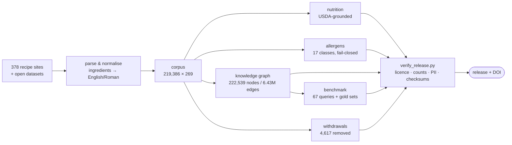
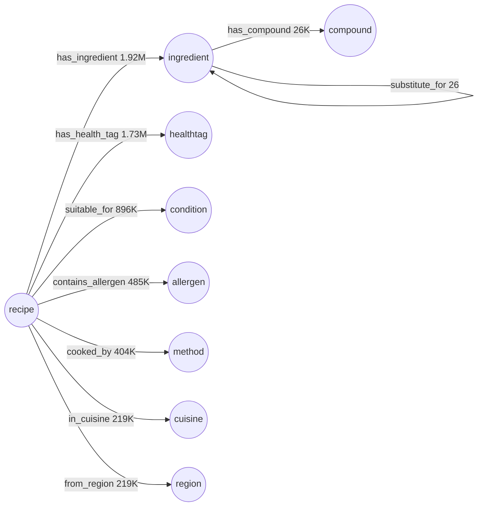

<div align="center">

# IndicRecipeNutri

> **Breaking changes in 0.6.0:** compound IDs are PubChem CIDs, graph splits use v3, the
> ingredient vocabulary lost names, and the `pairs_with` co-occurrence layer is fully
> recomputed. See [migration notes](docs/COMPOUND_ID_MIGRATION.md), the
> [changelog](CHANGELOG.md) and [current generated facts](data/provenance/release_facts.json).
> Historical DOI snapshots retain their original data and identifiers.

**A 219,386-recipe Indian corpus with parsed ingredients, a 17-class allergen surface,
dish-level nutrition, and a typed knowledge graph of 6.43 million edges.**

Built for retrieval and recommendation research that needs *culturally specific* food data —
and that needs to know exactly where the data is weak.

[](https://doi.org/10.5281/zenodo.22512534)
[](LICENSE-DATA)
[](LICENSE-CODE)
[](#the-data)
[](#the-data)

[Quick start](#-quick-start-60-seconds) ·
[The data](#the-data) ·
[Knowledge graph](#knowledge-graph) ·
[Allergens — read first](#-allergens-read-this-first) ·
[Verify your copy](#verify-what-you-downloaded) ·
[Cite](#citation)

</div>

---

## At a glance

| | |
|---|---|
| **Recipes** | 219,386, across **378 source sites** |
| **Columns** | 269; field definitions and current fill rates are in the generated data dictionary |
| **Knowledge graph** | 222,539 nodes · **6,428,210 edges** · 17 node types · 22 relation types |
| **Allergen classes** | 17, with an explicit `unknown` sentinel on 1,274 recipes |
| **Benchmark** | 67 fixed queries, 8 templates, graph-derived silver labels |
| **Interaction logs** | 2 synthetic sets — 50,000 users, 990,273 ratings each |
| **Ingredient text** | 100% English/Roman; original script kept as provenance |
| **Withdrawn** | 4,617 recipes, ids published so you can verify their absence |
| **Licence** | data CC BY-NC-SA 4.0 · code MIT |

> **New here? Read [`docs/DATASHEET.md`](docs/DATASHEET.md) before you build on this.**
> It documents measured defects rather than hiding them. The four things that bite people
> most are in [Allergens](#-allergens-read-this-first) and
> [Nutrition grounding](#nutrition-grounding-read-this-before-computing-anything) below.

---

## ⚡ Quick start (60 seconds)

```bash
git clone https://github.com/Poshaka-Research-Lab/IndicRecipeNutri-dataset
cd IndicRecipeNutri-dataset
git lfs pull                      # large artefacts are in Git LFS
pip install pandas pyarrow
```

```python
import pandas as pd

recipes = pd.read_parquet("data/corpus/recipes_structured.parquet")
print(len(recipes), "recipes,", len(recipes.columns), "columns")
# 219386 recipes, 269 columns
```

<details>
<summary><b>Four things you can do in one line each</b></summary>

```python
# 1. High-protein vegan mains
recipes[(recipes.Diet == "Vegan")
        & (recipes.Course == "Main Course")
        & (recipes.per100g_protein > 10)]

# 2. Everything from one state-level region
recipes[recipes.Region == "Kerala"]                    # 11,527 recipes

# 3. Recipes that are green on all four FSA traffic lights
recipes[(recipes.fsa_fat == "green") & (recipes.fsa_saturates == "green")
        & (recipes.fsa_sugars == "green") & (recipes.fsa_salt == "green")]

# 4. The knowledge graph, as edges
kg = pd.read_parquet("data/kg/kg_edges.parquet")       # 6,428,210 rows
kg[kg.rel == "contains_allergen"]                      # 485,120 rows
```

</details>

<details>
<summary><b>Allergen filtering — use the accessor, not the raw column</b></summary>

```python
from scripts.allergen_surface import load_wide

wide = load_wide()          # recipe_id × 17 classes, unassessed sentinel intact
```

Do **not** flatten `unknown` to `False`. It means *"never assessed"*, not *"safe"* — see
[Allergens](#-allergens-read-this-first).

</details>

---

## How it is built



Nothing is published that the verifier has not passed. A failing check aborts the release
instead of shipping it — see [Verify what you downloaded](#verify-what-you-downloaded).

---

## The data

| path | size | what is in it |
|---|---:|---|
| [`data/corpus/`](data/corpus) | 199 MB | the recipe table, plus long-form allergen / nutrition / label / quality tables, the rehydration index and the allergen audit |
| [`data/enrichment/`](data/enrichment) | 146 MB | 26 companion tables — nutrition, region, diet, quality flags, ingredient weights |
| [`data/provenance/`](data/provenance) | 58 MB | build records, per-field history, withdrawn-id lists |
| [`data/synthetic_interactions/`](data/synthetic_interactions) | 37 MB | 50,000 users, 990,273 ratings, with its own datasheet |
| [`data/synthetic_interactions_v3/`](data/synthetic_interactions_v3) | 35 MB | historical v3; includes 12 later-withdrawn catalogue items |
| [`data/kg/`](data/kg) | 33 MB | nodes, edges, typed store, ingredient vocabulary, pairing + substitution layers |
| [`data/benchmark/`](data/benchmark) | 0.2 MB | 67 queries, gold sets, contamination audit |
| [`data/kg_flavor/`](data/kg_flavor) | 0.1 MB | FlavorDB compound layer, kept separable (CC BY-NC-SA **3.0**) |

Parquet, zstd-compressed, 50,000-row groups. **≈508 MB** total.

> **Large files are in Git LFS.** A clone without `git-lfs` gives you 130-byte pointer stubs,
> and `verify_release.py --strict-checksums` fails loudly on them rather than validating a
> stand-in. Run `git lfs pull`. The Zenodo archive always contains the real files — the
> release workflow downloads its own zipball and fails the build if it ever finds pointers.

<details>
<summary><b>What the corpus covers</b></summary>

| facet | distinct | most common |
|---|---:|---|
| `Region` | 27 | Pan-Indian (135,055) · North India (12,108) · South India (11,581) · Kerala (11,527) · Tamil Nadu (11,375) |
| `Cuisine` | 53 | Indian (146,525) · American (12,719) · South Indian (9,879) · Kerala (9,403) |
| `Course` | 12 | Main Course (91,071) · Dessert (37,045) · Breakfast (19,420) |
| `Diet` | 5 | Vegetarian (88,632) · Vegan (83,940) · Non-Vegetarian (31,824) · Eggetarian (14,259) |

`Pan-Indian` dominates because most sources do not declare a region. **Slice on the
state-level regions for cultural work**, and treat `Pan-Indian` as "unlabelled", not as a
region.

</details>

---

## Knowledge graph

222,539 nodes, 6,428,210 edges, 17 node types, 22 relation types.



<details>
<summary><b>All 17 node types, with counts</b></summary>

| type | n | | type | n |
|---|---:|---|---|---:|
| `recipe` | 219,386 | | `nutrient` | 22 |
| `compound` | 1,607 | | `allergen` | 18 |
| `ingredient` | 927 | | `condition` | 13 |
| `foodclass` | 364 | | `course` | 12 |
| `cuisine` | 53 | | `method` | 11 |
| `occasion` | 44 | | `category` | 10 |
| `healthtag` | 30 | | `diet` | 8 |
| `region` | 27 | | `zone` | 5 |
| | | | `context` | 2 |

</details>

<details>
<summary><b>All 22 relation types, with counts</b></summary>

| relation | edges | | relation | edges |
|---|---:|---|---|---:|
| `has_ingredient` | 1,916,173 | | `shares_flavor` | 13,673 |
| `has_health_tag` | 1,725,659 | | `in_context` | 7,287 |
| `suitable_for` | 895,759 | | `pairs_with` | 3,224 |
| `contains_allergen` | 485,120 | | `rich_in` | 3,003 |
| `cooked_by` | 404,237 | | `grounded_as` | 370 |
| `has_diet` | 256,151 | | `is_a` | 148 |
| `is_course` | 219,386 | | `typical_region` | 48 |
| `in_cuisine` | 219,386 | | `in_zone` | 27 |
| `from_region` | 219,386 | | `substitute_for` | 26 |
| `for_occasion` | 33,357 | | `derived_from` | 25 |
| `has_compound` | 25,748 | | `subtype_of` | 17 |

`subtype_of` is new in 0.6.0: "is a kind of", ingredient → ingredient. It is **descriptive and
never a safety path** — `contains_allergen` remains the only edge an allergen filter may trust.
`derived_from` answers a different question, *what was this made from*, so a specific oil carries
both: `sesame-oil subtype_of oil` and `sesame-oil derived_from sesame`.

</details>

---

## Benchmark

67 retrieval queries with knowledge-graph-derived gold sets, across 8 templates:

| template | queries | | template | queries |
|---|---:|---|---|---:|
| `ingredient` | 12 | | `diet+allergenfree` | 7 |
| `condition` | 12 | | `course` | 6 |
| `diet+nutrient` | 12 | | `cuisine` | 6 |
| `diet` | 7 | | `diet+ingredient` | 5 |

> Gold sets are **graph-derived silver labels, not human judgments.** They are suitable for
> comparing systems against each other on this corpus; they are not a human relevance
> standard. `data/benchmark/GOLD_SET_AUDIT.json` records the contamination audit.

---

## 🔺 Allergens: read this first

17 classes — the FALCPA 9, two EU FIC additions (celery, sulphites), five
investigator-defined South Asian classes, and `ghee` tracked separately from `milk`.

| class | recipes | | class | recipes |
|---|---:|---|---|---:|
| `milk` | 116,435 | | `fenugreek` | 20,025 |
| `gluten` | 72,015 | | `sesame` | 13,729 |
| `coconut` | 36,824 | | `tamarind` | 12,163 |
| `mustard` | 36,687 | | `peanut` | 11,476 |
| `ghee` | 33,541 | | `soy` | 9,050 |
| `tree_nuts` | 33,280 | | `fish` | 5,829 |
| `asafoetida` | 30,607 | | `shellfish` | 4,202 |
| `sulphites` | 23,989 | | `celery` | 2,357 |
| `egg` | 21,637 | | **`unknown`** | **1,274** |

**Four things you must know before building anything safety-facing.**

1. **`unknown` is a real value and never means "safe".** 1,274 recipes were never assessed.
   The contract is fail-closed: unknown ⇒ treat as unsafe. Every accessor in `scripts/`
   preserves the sentinel. Flatten it to `False` and you have inverted the safety property.
2. **The South Asian five are investigator-defined, not regulator-derived.** FSSAI's
   mandatory list (Labelling and Display Regulations 2020, clause 5(14)) names none of
   mustard, fenugreek, asafoetida, tamarind or coconut. Do not present them as carrying
   regulatory authority.
3. **The audit is a consistency check, not an accuracy measurement.** It compares two
   independently written lexicons; agreement means they agree, not that either is right. A
   returned pilot has 794 rows: 202 TP, 38 FP, 118 FN, 433 TN and 3 unclear.
   The predicted-positive stratum has 240 rows; zero FN in that selected stratum
   does not measure sensitivity. Raw FNR 118/320 describes this sample only.
   Reviewer independence and population weights are unverified; no corpus rate is claimed.
4. **`sulphites` is not independently auditable, and is reported as such.** The label comes
   from a *carrier* rule — vinegar, raisins, wine, dried fruit — because that is where
   sulphites are. A home recipe never names the additive, so the independent lexicon matches
   0 of 23,989 flagged rows **by construction**. Giving it a carrier list would make it
   agree with the labeller on the labeller's own theory and report that as corroboration,
   so it deliberately does not.

> **Do not use these flags as the sole basis for an end-user safety decision.**

---

## Nutrition grounding, read this before computing anything

> The food composition table uses the **IFCT 42-nutrient schema**, but **contains no IFCT
> data and no Indian composition data.** Its values are **7,793 USDA rows (97.5%)** plus
> 198 INDB US/UK rows, established by reading `primarysource` in the source spreadsheets.
>
> **The schema is Indian; the data is Western.** Do not describe this corpus as
> IFCT-grounded or as India-grounded in its nutrition. Grounding in IFCT 2017 or INDB proper
> is an open enhancement, not a property of this release — which is why the column ships as
> `nut_suppl_fct_frac`. The narrow quality table also retains `nut_indb_frac` as a
> deprecated compatibility alias with identical values. This is the share of
> computed ingredient calories from supplemental FCT rows. Legacy zero values can
> also indicate an unavailable calorie denominator.

Two nutrient bases were traced to the builder and are easy to get wrong:

| column | basis | consequence |
|---|---|---|
| `Nut_VitaminA` | **µg RAE** (FoodData Central nutrient 1106) | not IU, not retinol — they differ by up to 12× for plant carotenoids |
| `Nut_Folate` | **total folate** (nutrient 1177), **not DFE** | `DV_Folate` is unavailable; `DV_Folate_basis` explains the mismatch. Previous unsupported percentages are retained in field history. |

Unit and basis declarations are machine-readable in the Parquet field metadata and
human-readable in [`docs/UNITS.json`](docs/UNITS.json).

---

## What is *not* here, and why

**Recipe prose is not redistributed.** Headnotes, free-text instructions, the raw ingredient
string and keywords can be copyrightable. The parsed ingredient list, nutrition estimates and
every typed attribute are published; the prose is not.

<details>
<summary><b>How to get the prose back yourself (rehydration)</b></summary>

`data/corpus/rehydration_index.parquet` carries each recipe's source URL and a SHA-256 digest
of the prose the corpus was derived from, so you can re-fetch and verify you reconstructed
the same text:

```bash
python scripts/rehydrate.py --out prose.parquet --limit 100
```

**214,579 of 219,386 rows are rehydratable.** The other 4,807 came from pre-existing datasets
rather than scraped pages and carry placeholder URLs, flagged
`source_kind = "derived_dataset"`.

</details>

<details>
<summary><b>The 4,617 withdrawn recipes</b></summary>

Absent from every published artefact:

| population | rows | why |
|---|---:|---|
| V7 non-recipe | 3,815 | archive listings, shop pages, image attachments, commodity records — pages that were never recipes |
| V8 grihshobha | 801 | the scraper never found an ingredient list on that site; it captured the page navigation bar |
| PII | 1 | the scrape captured the site owner's email address |

Their **ids** — ids only, never the records — are published in
`data/provenance/withdrawn_ids.json`, so you can verify their absence for yourself. The
quarantine records stay unpublished because they hold exactly the content the withdrawal
removed.

</details>

Large derived artefacts — dense and structural embedding matrices, the pickled graph — are
excluded. The graph is regenerable with `python scripts/build_graph.py --out DIR`. The
embedding matrices are planned as a separate Zenodo record, which does not exist yet.

---

## Verify what you downloaded

The release verifies itself, and **the check runs on your clone, not only on ours**:

```bash
python scripts/verify_release.py --strict-checksums
```

| check | what it protects |
|---|---|
| licence | no withheld prose column, by stem, in any artefact |
| integrity | row, node, edge and query counts against pinned expectations |
| privacy | PII pattern sweep over every string column |
| checksums | SHA-256 manifest, **in both directions** — a file with no digest fails too |
| authorship | `.zenodo.json` and `CITATION.cff` name the same people |
| disclosure | every audit artefact the datasheet refers to is present |

No network, no source tree, no credentials required.

<details>
<summary><b>Reproducing the whole build</b></summary>

```bash
python scripts/build_corpus.py
python scripts/build_kg.py
python scripts/build_enrichment.py
python scripts/build_benchmark.py
python scripts/audit_corpus.py
python scripts/validate_sa5.py
python scripts/make_data_dictionary.py
python scripts/make_checksums.py
python scripts/verify_release.py --strict-checksums
```

`scripts/release_config.py` is the single source of truth for the withheld-column list and
the expected counts; builders and verifier both import it, so the licence guard cannot drift
from what is published.

Releasing is tag-driven and verifies before it publishes — see
[`docs/RELEASING.md`](docs/RELEASING.md).

</details>

---

## FAQ and known gotchas

<details>
<summary><b>Why is <code>Pan-Indian</code> 62% of the corpus?</b></summary>

Because most sources do not declare a region. It means "unlabelled", not "a region". For
cultural analysis, slice on the state-level regions and exclude the supra-regional buckets —
otherwise you are comparing a labelled slice against an unlabelled remainder.

</details>

<details>
<summary><b>Why do allergen counts exceed what the ingredient text says?</b></summary>

Deliberately, for composite spices. Chaat masala, sambar powder and pav bhaji masala contain
asafoetida without naming it, so a recipe calling for chaat masala is labelled for
asafoetida. That is the fail-closed behaviour Codex CXC 80-2020 requires, and it is why that
class's text-agreement is 77.6% while the others are 89–99%. The breakdown ships with the
figure in [`docs/allergen_sa5_v1_validation.md`](docs/allergen_sa5_v1_validation.md).

</details>

<details>
<summary><b>My clone has 130-byte files where the data should be</b></summary>

Those are Git LFS pointer stubs. Install `git-lfs` and run `git lfs pull`. The verifier
fails loudly on them rather than validating a stand-in, which is deliberate.

</details>

<details>
<summary><b>Can I use this commercially?</b></summary>

No. The data is CC BY-NC-SA 4.0. The **code** is MIT and has no such restriction.

</details>

<details>
<summary><b>Which DOI should I cite?</b></summary>

The **concept DOI**, `10.5281/zenodo.22512534` — it always resolves to the latest version.
Pin a version DOI only if your result depends on an exact snapshot.

</details>

---

## Licence

| | |
|---|---|
| **Data** | **CC BY-NC-SA 4.0** ([`LICENSE-DATA`](LICENSE-DATA)) — per-recipe attribution retained in the `SourceSite` and `URL` columns |
| **Code** | **MIT** ([`LICENSE-CODE`](LICENSE-CODE)) |

**Third-party layers** — USDA SR Legacy (public domain), UK CoFID (Open Government Licence),
FoodOn (CC BY 4.0), FlavorDB (CC BY-NC-SA 3.0 — present in `data/kg/` as well as
`data/kg_flavor/`, 1,607 compound nodes and 40,049 edges, so the core graph is **not** free
of its terms).

> **RecipeDB NER, IFCT 2017 and INDB were previously listed as dependencies and are not used
> at all.** The per-layer audit is in
> [`docs/THIRD_PARTY_TERMS.md`](docs/THIRD_PARTY_TERMS.md).

<details>
<summary><b>Why NonCommercial, when most layers are permissive?</b></summary>

The licence moved twice while the dependencies were audited. Three of six recorded
third-party layers turned out never to have been used, which would have allowed CC BY 4.0 —
but **9,384 recipes (4.28%) from upstream NC/NC-SA datasets are retained by decision**, so
NonCommercial and ShareAlike apply to the whole corpus. `LICENSE-DATA` records the one-line
route back to CC BY 4.0 if those recipes are ever dropped.

</details>

To request removal of content, see [`docs/TAKEDOWN.md`](docs/TAKEDOWN.md).

---

## Citation

```bibtex
@dataset{badgujar_borde_gurav_indicrecipenutri,
  author    = {Badgujar, Hemprasad Y. and Borde, Santosh P. and Gurav, Yogesh},
  title     = {IndicRecipeNutri},
  year      = {2026},
  publisher = {Zenodo},
  doi       = {10.5281/zenodo.22512534},
  url       = {https://doi.org/10.5281/zenodo.22512534}
}
```

Cite the **concept DOI** above unless you need to pin a version:
`10.5281/zenodo.22512535` (0.3.0) · `10.5281/zenodo.22537252` (0.4.0).

Machine-readable metadata is in [`CITATION.cff`](CITATION.cff) and
[`.zenodo.json`](.zenodo.json), and the two are checked against each other at release time —
the published record is generated from `.zenodo.json`, so a disagreement would mean the DOI
credits a different author list than the repository does.

The associated paper is *IndicRecipeNutri: A Single-Store, Tri-Modal, Explainable Retriever
for Nutrition-Grounded Indian Recipe Recommendation* — venue and DOI pending.

---

## Documentation map

| document | read it when |
|---|---|
| [`docs/DATASHEET.md`](docs/DATASHEET.md) | **before using the data** — motivation, composition, measured defects |
| [`docs/DATA_DICTIONARY.md`](docs/DATA_DICTIONARY.md) | you need to know what a column means |
| [`docs/UNITS.json`](docs/UNITS.json) | you are computing on a numeric column |
| [`docs/PROVENANCE.md`](docs/PROVENANCE.md) | you need to trace where a value came from |
| [`docs/THIRD_PARTY_TERMS.md`](docs/THIRD_PARTY_TERMS.md) | you are redistributing or building a product |
| [`docs/SPLIT_PROTOCOL_v3.md`](docs/SPLIT_PROTOCOL_v3.md) | you are training and need the current splits |
| [`docs/RELEASING.md`](docs/RELEASING.md) | you are cutting a release |
| [`docs/TAKEDOWN.md`](docs/TAKEDOWN.md) | you want content removed |
| [`CHANGELOG.md`](CHANGELOG.md) | you want to know what moved, and why |

<div align="center">

**Known defects are published, not hidden.**
If you find one we have not, please open an issue.

</div>
